# CT17 -- Implementation Diagrams

Code-block diagrams referenced from `Graph.cpp`.

---

## 1. add_vertex() — Idempotent Vertex Insertion
*`Graph.cpp::add_vertex()` -- check if vertex exists, insert with empty neighbor list if new*

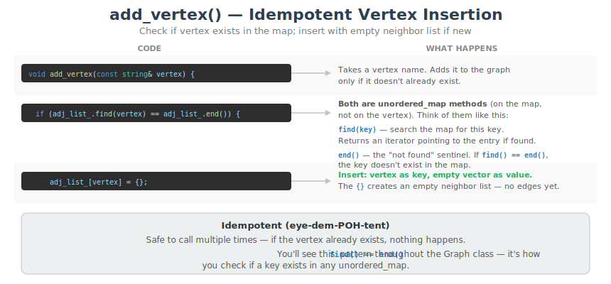

---

## 2. add_edge() — Undirected Edge
*`Graph.cpp::add_edge()` -- adding to both neighbor lists for an undirected graph*

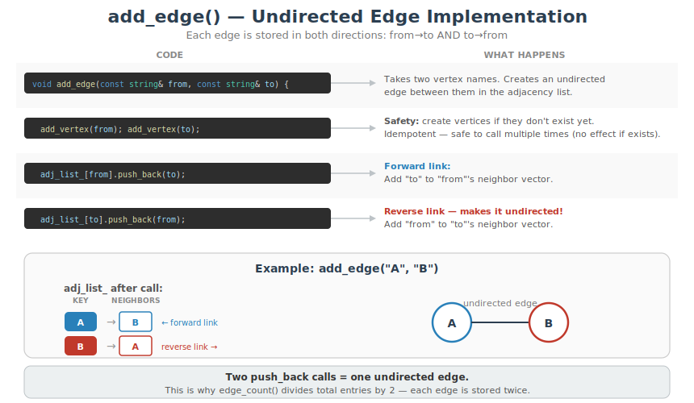

---

## 3. has_vertex() — O(1) Vertex Lookup
*`Graph.cpp::has_vertex()` -- hash table lookup to check if vertex exists*

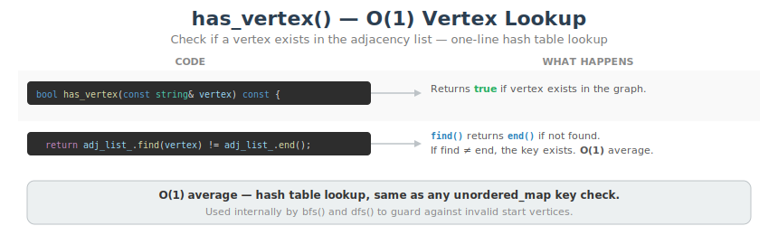

---

## 4. has_edge() — Two-Step Edge Lookup
*`Graph.cpp::has_edge()` -- find the vertex, then search its neighbor list*

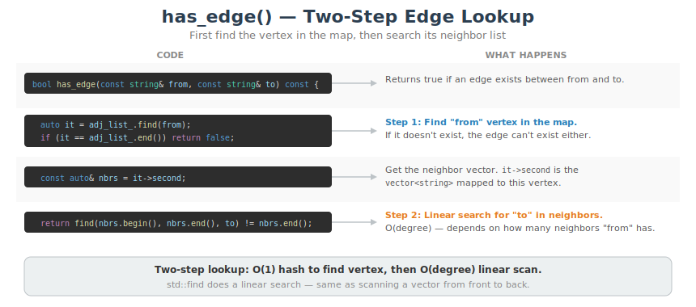

---

## 4b. has_edge() — Step-by-Step Trace
*`Graph.cpp::has_edge()` -- tracing has_edge("A", "C") showing how it, it->first, and it->second work*

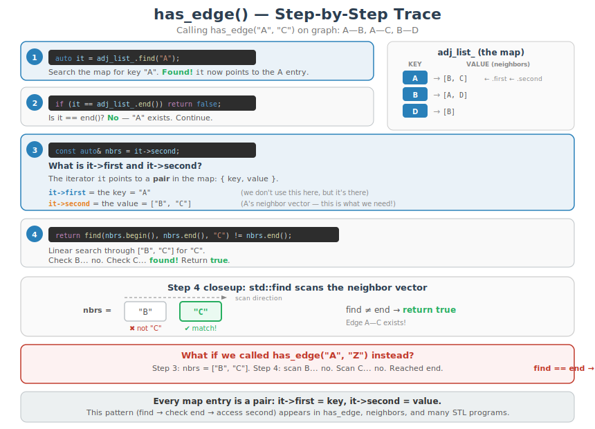

---

## 5. vertex_count() — Map Size
*`Graph.cpp::vertex_count()` -- one entry per vertex in the unordered_map*

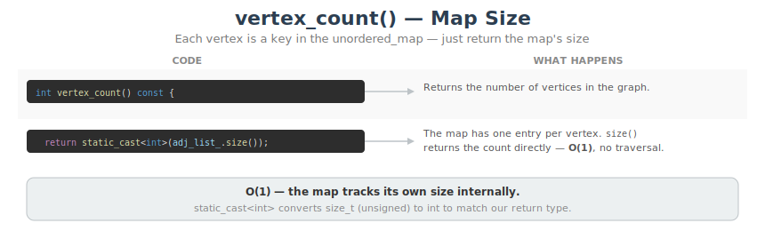

---

## 6. edge_count() — Sum Neighbors, Divide by 2
*`Graph.cpp::edge_count()` -- each undirected edge is stored twice*

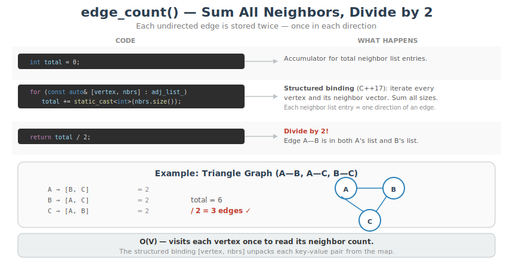

---

## 6b. edge_count() — For Loop Breakdown + Trace
*`Graph.cpp::edge_count()` -- structured binding syntax explained, then traced iteration by iteration*

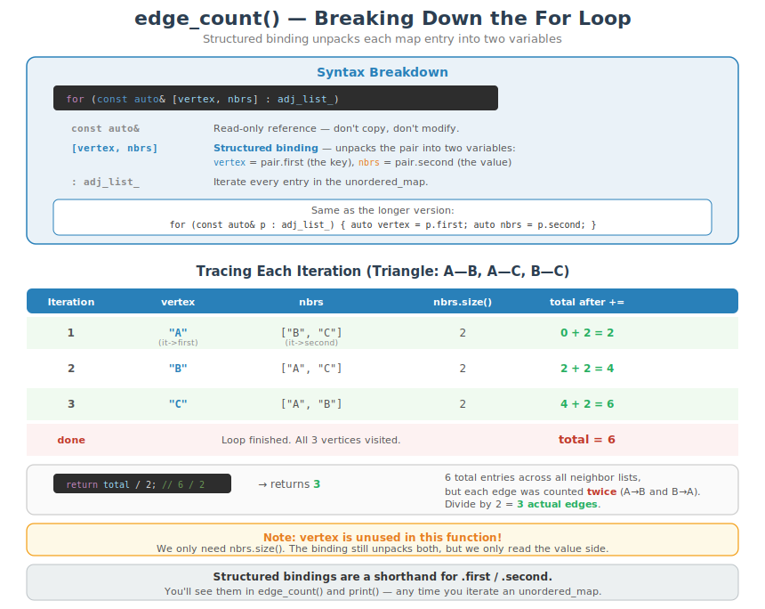

---

## 7. neighbors() — Return Neighbor List
*`Graph.cpp::neighbors()` -- find vertex, return copy of its neighbor vector*

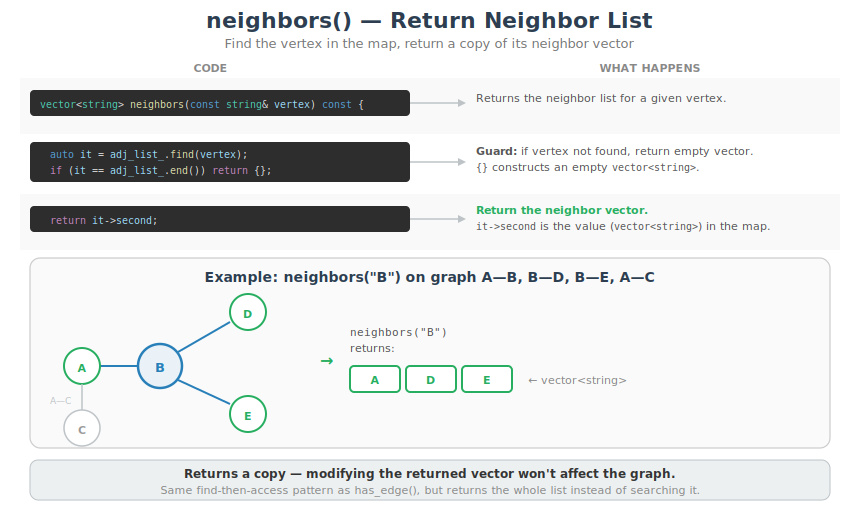

---

## 8. BFS — Queue-Based Traversal
*`Graph.cpp::bfs()` -- queue drives level-by-level exploration*

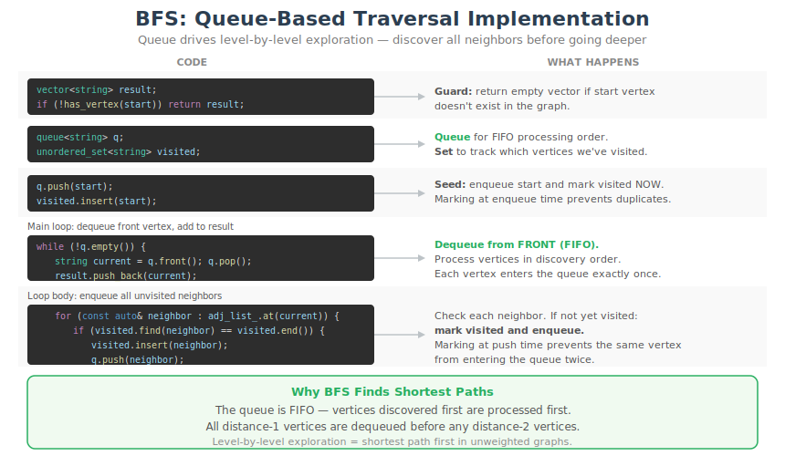

---

## 8b. BFS — Code Execution Trace
*`Graph.cpp::bfs()` -- tracing bfs("A") step by step: which line runs, what q/visited/result contain*

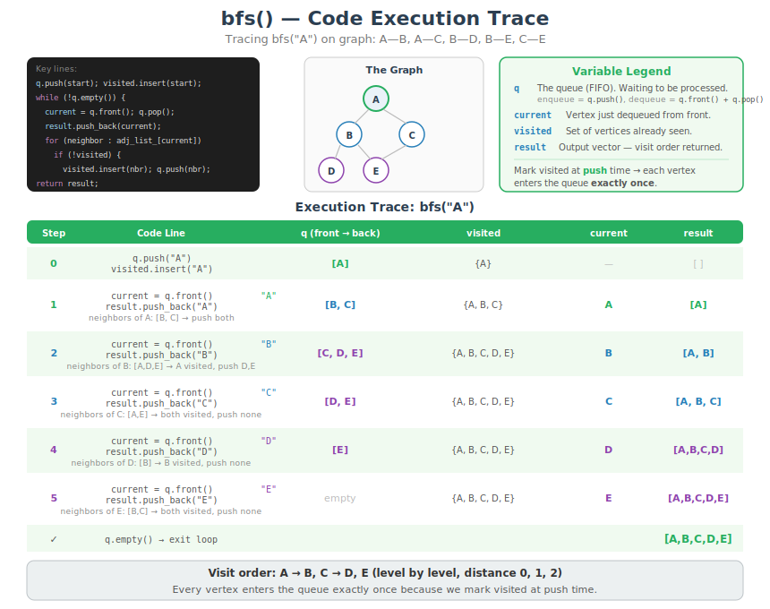

---

## 9. DFS — Stack-Based Traversal
*`Graph.cpp::dfs()` -- stack drives depth-first exploration*

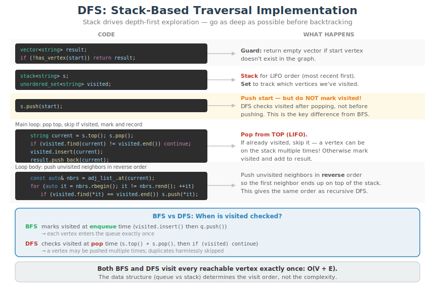

---

## 9a. DFS — Reverse Push Breakdown
*`Graph.cpp::dfs()` -- rbegin/rend, *it dereference, and why we push neighbors in reverse*

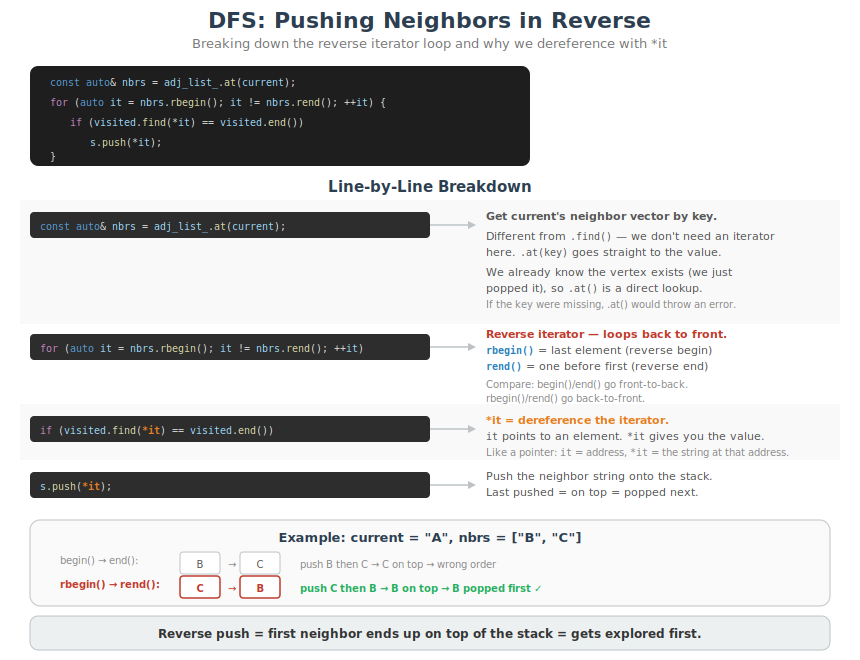

---

## 9b. DFS — Code Execution Trace
*`Graph.cpp::dfs()` -- tracing dfs("A") step by step: shows duplicate on stack at step 6 being skipped*

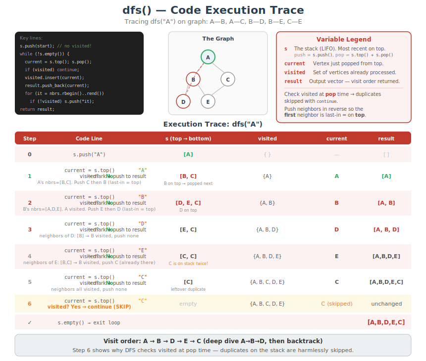

---

## 10. print() — Display Adjacency List
*`Graph.cpp::print()` -- iterate all vertices and print neighbor lists*

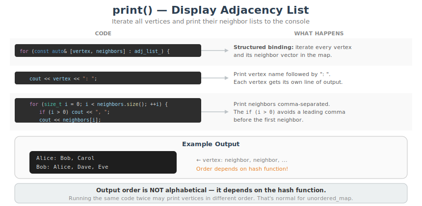
