# CT17 -- Header Diagrams

Conceptual diagrams referenced from `Graph.h`.

---

## 1. What Is a Graph?
*`Graph.h` -- vertices (nodes) connected by edges (links) -- unlike trees, graphs can have cycles*

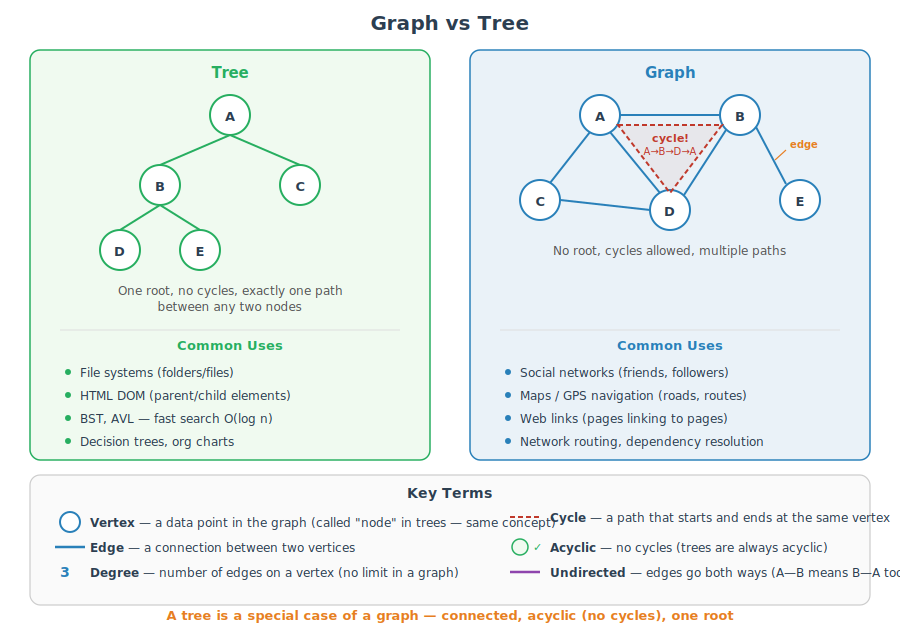

---

## 2. unordered_map — The Data Structure Behind Our Graph
*`Graph.h` -- each vertex name is a key, its neighbor list is the value*

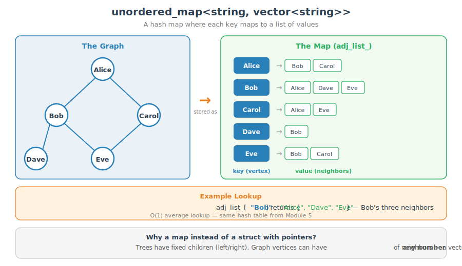

---

## 3. Breaking Down the Declaration
*`Graph.h` -- what each part of `std::unordered_map<std::string, std::vector<std::string>> adj_list_` means*

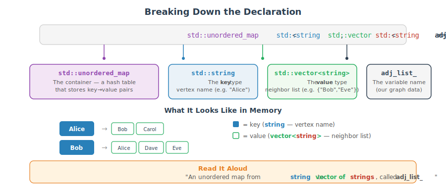

---

## 4. Modifiers: add_vertex() and add_edge()
*`Graph.h` -- building the graph step by step*

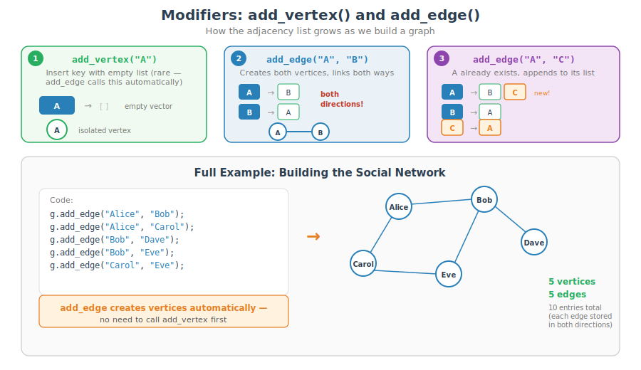

---

## 5. Queries: Asking Questions About the Graph
*`Graph.h` -- reading from the adjacency list without modifying it*

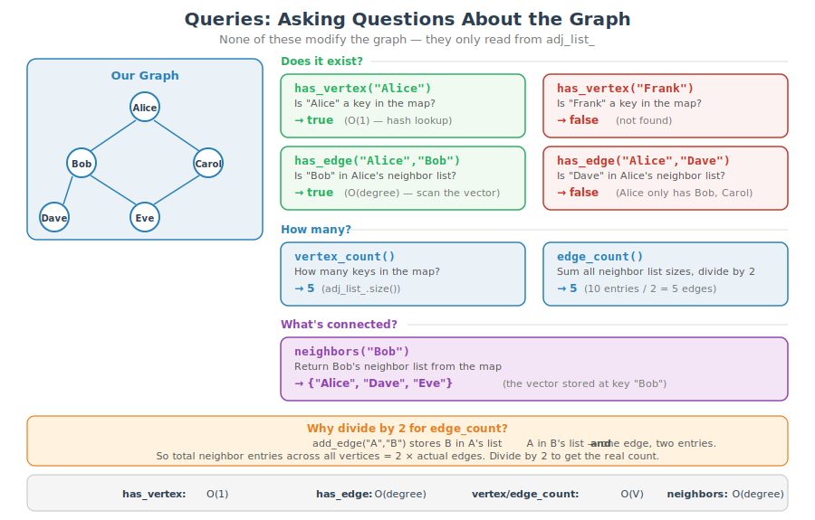

---

## 6. Breaking Down the neighbors() Signature
*`Graph.h` -- what each part of `std::vector<std::string> neighbors(const std::string& vertex) const` means*

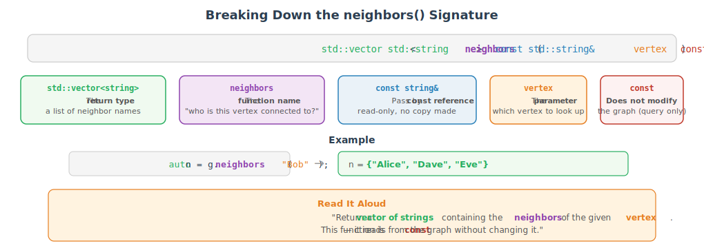

---

## 7. Adjacency List vs Adjacency Matrix
*`Graph.h` -- two ways to represent graph connections in code*

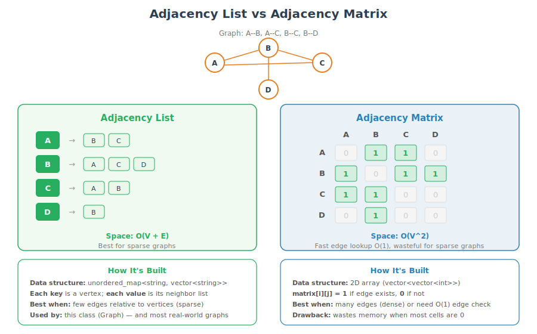

---

## 8. BFS &#x2014; Breadth-First Search
*`Graph.h::bfs()` -- explore level by level using a queue*

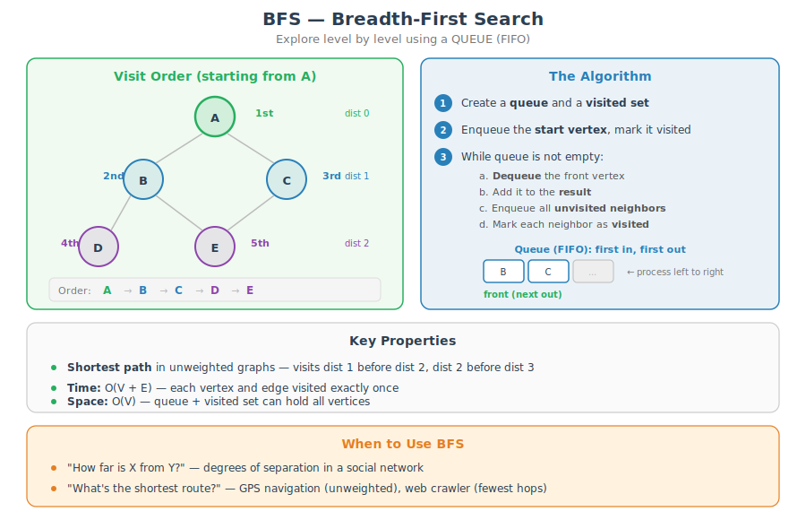

---

## 9. BFS Step-by-Step Trace
*Follow the queue through every step of BFS starting from A*

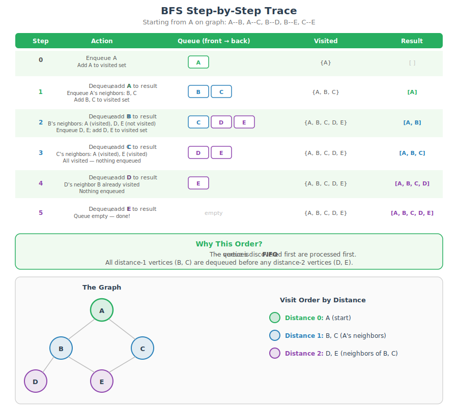

---

## 10. DFS &#x2014; Depth-First Search
*`Graph.h::dfs()` -- dive deep first using a stack*

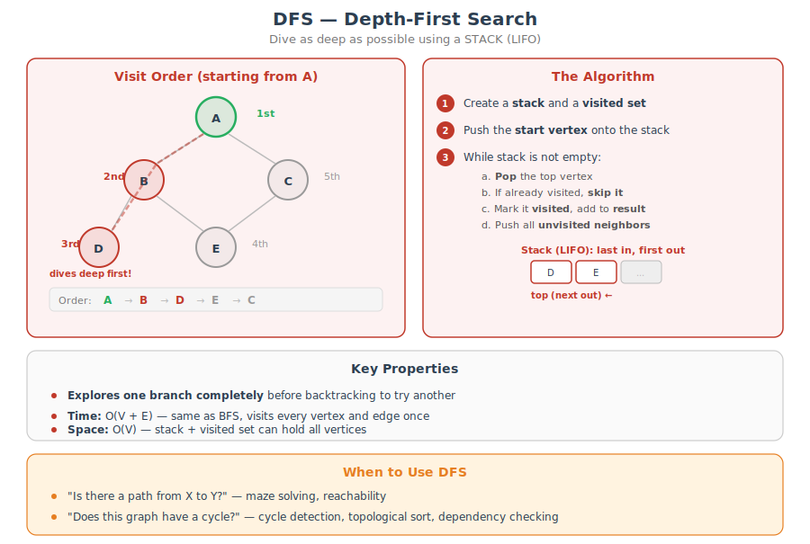

---

## 11. DFS Step-by-Step Trace
*Follow the stack through every step of DFS starting from A*

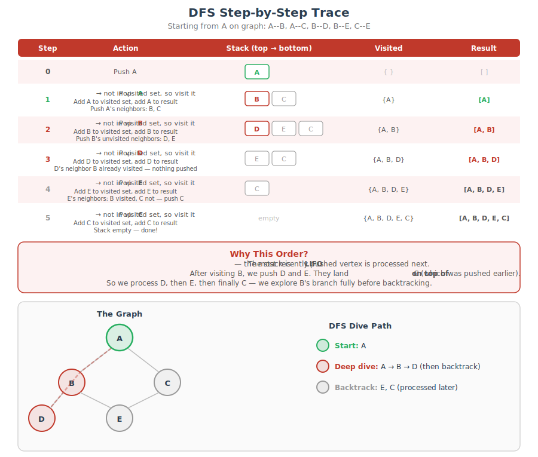
