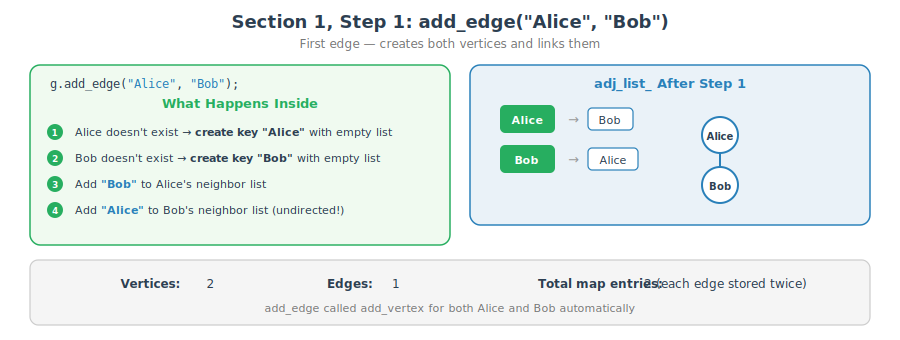
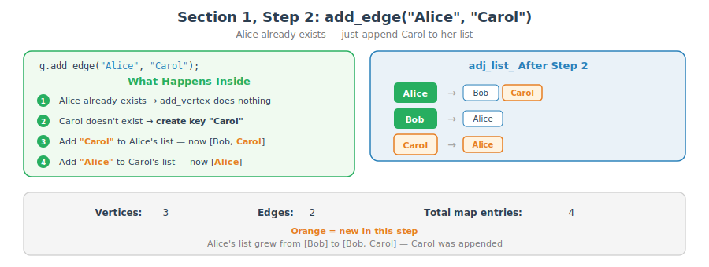
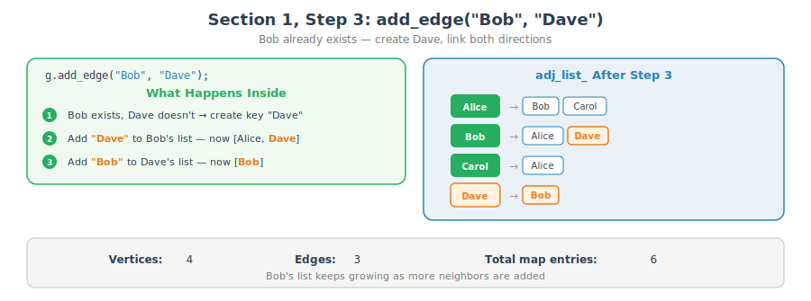
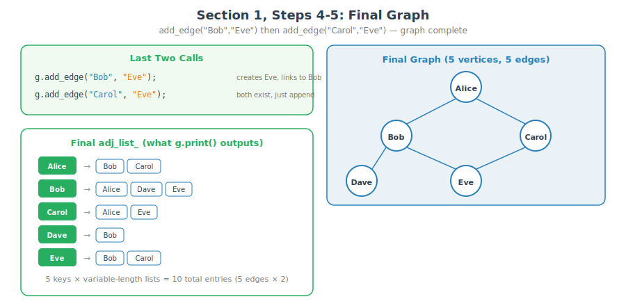
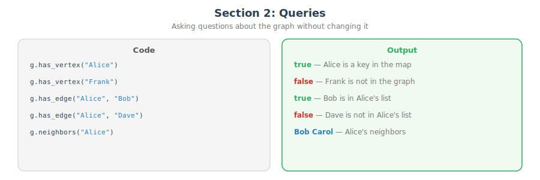
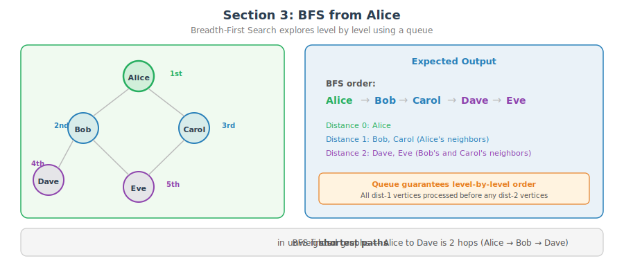
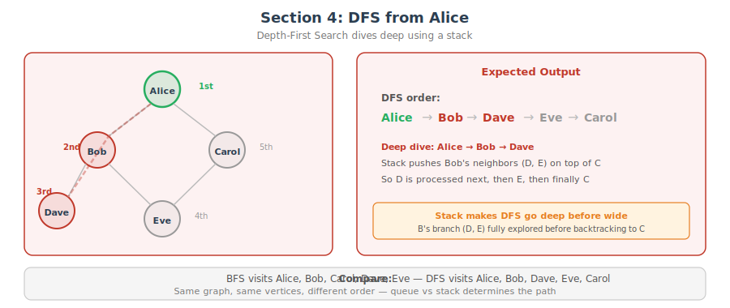

# CT17 -- Main Demo Diagrams

Visual walkthrough of the graph states in `main.cpp`.

---

## 1a. Build a Graph: add_edge("Alice", "Bob")
*`main.cpp` Section 1 -- first edge creates both vertices and links them*

---

## 1b. Build a Graph: add_edge("Alice", "Carol")
*`main.cpp` Section 1 -- Alice already exists, Carol is new, append to Alice's list*

---

## 1c. Build a Graph: add_edge("Bob", "Dave")
*`main.cpp` Section 1 -- Bob already exists, Dave is new*

---

## 1d. Build a Graph: Final State
*`main.cpp` Section 1 -- after add_edge("Bob","Eve") and add_edge("Carol","Eve"), the graph is complete*

---

## 2. Queries
*`main.cpp` Section 2 -- has_vertex, has_edge, neighbors: asking questions without modifying*

---

## 3. BFS from Alice
*`main.cpp` Section 3 -- Breadth-First Search visits level by level: Alice, then Bob/Carol, then Dave/Eve*

---

## 4. DFS from Alice
*`main.cpp` Section 4 -- Depth-First Search dives deep: Alice, Bob, Dave, then backtracks to Eve, Carol*

